PHP + BPC + raylib/raygui 开发简易桌面小程序

# 02. Gui Controls Overview

## 1. Basic controls set

| Screenshot                                                   | Code                                                         |
| ------------------------------------------------------------ | ------------------------------------------------------------ |
| 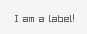                                        | `GuiLabel(array(190, 200, 100, 40), "I am a label!");`       |
| 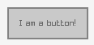                                       | `GuiButton(array(190, 200, 100, 40), "I am a button!");`     |
| 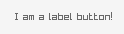                                 | `GuiLabelButton(array(190, 200, 100, 40), "I am a label button!");` |
| 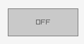 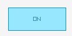         | `GuiToggle(array(190, 200, 100, 40), $active ? 'ON' : 'OFF', $active);` |
| 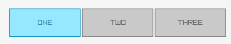                                 | `GuiToggleGroup(array(190, 200, 100, 40), 'ONE;TWO;THREE', $toggleGroupActive);` |
| 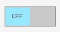 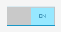 | `GuiToggleSlider(array(190, 200, 100, 40), 'OFF;ON', $toggleSliderActive);` |
|  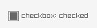 | `GuiCheckBox(array(190, 200, 15, 15), 'checkbox: ' . ($checked ? 'checked' : 'unchecked'), $checked);` |
| 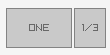 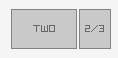 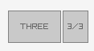 | `GuiComboBox(array(190, 200, 100, 40), 'ONE;TWO;THREE', $active);` |
| 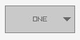 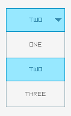 | `if (GuiDropdownBox(array(190, 200, 100, 40), 'ONE;TWO;THREE', $active, $editMode)) { $editMode = !$editMode; }` |
| 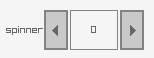 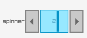         | `if (GuiSpinner(array(190, 200, 100, 40), 'spinner', $value,  0, 100, $editMode)) { $editMode = !$editMode; }` |
| 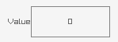 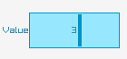       | `if (GuiValueBox(array(190, 200, 100, 40), 'Value', $value,  0, 100, $editMode)) { $editMode = !$editMode; }` |
| 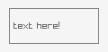 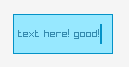         | `$textBuf = str_pad("text here!", 100, "\0"); ... if (GuiTextBox(array(190, 200, 100, 40), $textBuf, $filledLen, $editMode)) { $editMode = !$editMode; echo "your input: ", substr($textBuf, 0, $filledLen), "\n"; } ` |
| 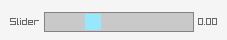                                       | `GuiSlider(array(190, 200, 150, 20), "Slider", sprintf("%2.2f", $sliderValue), $sliderValue, -50, 100);` |
| 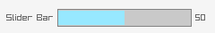                                   | `GuiSliderBar(array(190, 200, 150, 20), "Slider Bar", (int)$sliderBarValue, $sliderBarValue, 0, 100);` |
|                                  | `$progressValue = 0.8; GuiProgressBar(array(190, 200, 150, 20), "Progress Bar", ((int)($progressValue * 100)) . '%', $progressValue, 0, 1);` |
| 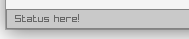                                   | `GuiStatusBar(array(0, 430, 800, 20), "Status here!");`      |
| 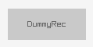                                    | `GuiDummyRec(array(190, 200, 100, 40), "DummyRec");`         |
| 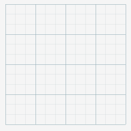                                         | `GuiGrid(array(190, 200, 200, 200), 50, 3, $mouseCell);`     |

## 2. Advance controls set

| Screenshot                                                   | Code                                                         |
| ------------------------------------------------------------ | ------------------------------------------------------------ |
| 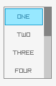 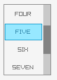 | `GuiListView(array(190, 200, 80, 120), "ONE;TWO;THREE;FOUR;FIVE;SIX;SEVEN;EIGHT;NINE;TEN", $scrollIndex, $active);` |
| 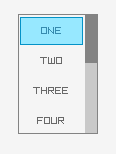                                 | `GuiListViewEx(array(190, 200, 80, 120), array('ONE', 'TWO', 'THREE', 'FOUR', 'FIVE', 'SIX', 'SEVEN', 'EIGHT', 'NINE', 'TEN'), $scrollIndex, $active, $focus);` |
| 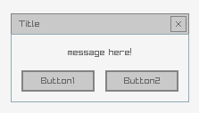                                  | `GuiMessageBox(array(190, 200, 200, 100), 'Title', 'message here!', 'Button1;Button2');` |
| 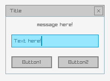                               | `GuiTextInputBox(array(190, 200, 200, 140), 'Title', 'message here!', 'Button1;Button2', $textBuf, $filledLen);` |
| 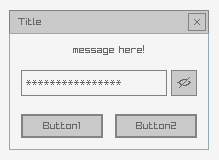                   | `GuiTextInputBox(array(190, 200, 200, 140), 'Title', 'message here!', 'Button1;Button2', $textBuf, $filledLen, $secretViewActive);` |
| 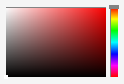                                 | `GuiColorPicker(array(190, 200, 200, 140), $color);`         |
| 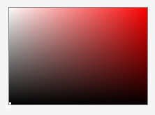                                  | `GuiColorPanel(array(190, 200, 200, 140), $color);`          |
| 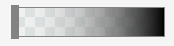                              | `GuiColorBarAlpha(array(190, 200, 150, 30), $alpha);`        |
| 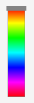                                | `GuiColorBarHue(array(190, 200, 30, 150), $value);`          |
| 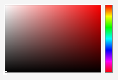                             | `GuiColorPickerHSV(array(190, 200, 200, 140), $colorHsv);`   |
| 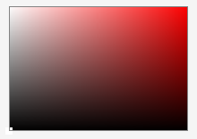                              | `GuiColorPanelHSV(array(190, 200, 200, 140), $colorHsv);`    |

## 3. Container/separator controls

